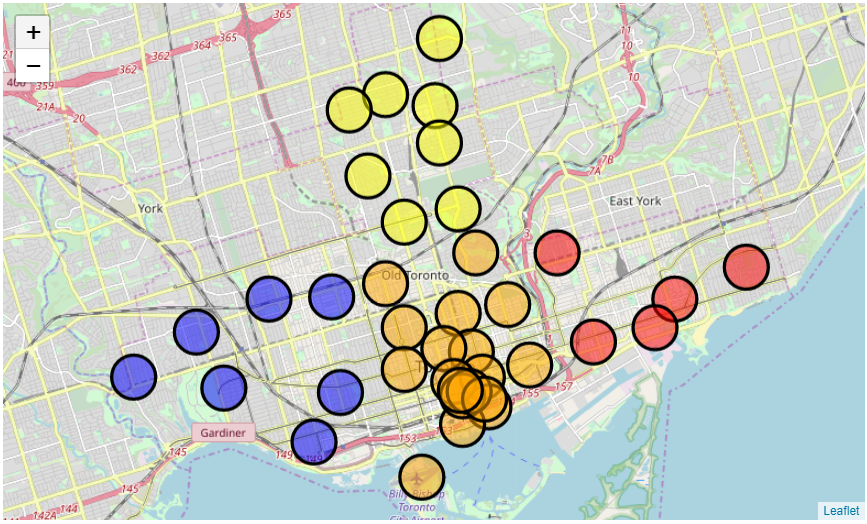

# Segmenting and Clustering Neighborhoods in Toronto

In this notebook, I will explore and cluster the neighbourhoods of Toronto by web-scraping postal codes, building an appropriate dataframe, then visualizing our data.

{ width=100% }


## Section 1: Data collection
In this section, I will scrape the postal codes of Canada off the relevant wikipedia page and put the results in a dataframe. After a little bit of data cleaning, it will be merged with lat and lon coordinates for visualization purposes later.


```python
# inviting the VIPs to the party
import numpy as np
import pandas as pd
import json
import requests
```


```python
# also invite party people who have good design
pd.set_option('display.max_colwidth', -1)
```


```python
#special guests in order to do some postcal code web-scraping
from bs4 import BeautifulSoup
from urllib.request import urlopen
```


```python
#scrape the data from the wikipedia page
path = "https://en.wikipedia.org/wiki/List_of_postal_codes_of_Canada:_M"
page = urlopen(path).read()
bsoup = BeautifulSoup(page, 'html.parser')

relevant = bsoup.body.table.tbody
```


```python
# parsing all the data into a dataframe
data = []
for tr in wiki_table.find_all('tr'):
    row = []
    tds = tr.find_all('td')
    for td in tds:    
        if td.text:
            relevant = td.text.strip()
            row.append(relevant)
    if len(row) >= 3:
        data.append(row)

columns = ['PostalCode', 'Borough', 'Neighborhood']
df = pd.DataFrame(data, columns=columns)
print('There are {0} rows and {1} columns in this dataframe.'.format(df.shape[0],df.shape[1]))
df
```

    There are 288 rows and 3 columns in this dataframe.
    


```python
# Remove rows with Boroughs that are 'Not Assigned'
df = df[df.Borough != 'Not assigned']
# reset the index
df.reset_index(inplace=True,drop=True)
```


```python
# Group Neighborhoods with the same PostalCode and Borough
df = df.groupby(['PostalCode','Borough'])['Neighborhood'].apply(lambda x: ','.join(x.astype(str))).reset_index()
```


```python
print('There are now {0} rows and {1} columns in this dataframe after data cleaning.'.format(df.shape[0],df.shape[1]))
```

    There are now 103 rows and 3 columns in this dataframe after data cleaning.
    

## Section 2: Data preparation
This section will merge the local geospatial data to the Postal Codes found on the wikipedia page in the aforementioned section.


```python
# Add Latitude and Longitude to the dataframe using local geospatial data
geo = pd.read_csv('./Geospatial_Coordinates.csv')
df = df.merge(geo, left_on='PostalCode', right_on='Postal Code').drop(columns=['Postal Code'])
```

## Section 3: Modeling
In this section, I will model the resulting dataframe onto a map to better visualize the data clusters in Toronto.


```python
# Only working with boroughs that contain the word 'Toronto'
df = df[df['Borough'].str.contains("Toronto")]
df.reset_index(inplace=True,drop=True)
```


```python
# also invite party people who have good style
from sklearn.cluster import KMeans
import folium
```


```python
# Check how many clusters we are interested in
df['Borough'].value_counts()
```


    Downtown Toronto    18
    Central Toronto     9 
    West Toronto        6 
    East Toronto        5 
    Name: Borough, dtype: int64


### Approach:
I decided the best way to visualize the different sections of Toronto was to cluster the data points into four distinct groups, based on the number of unique values in the Borough Column (Downtown, Central, West, and East Toronto). Using KMeans as a model, I am going to section off each cluster based on its lat and lon coordinates. I gained some inspiration from online resources to use Folium to best represent this clustering method because it is indeed the easiest way to generate maps. The paramters on the maps are best suited for visualizing the four clusters in relation to the Boroughs of Toronto. 


```python
toronto = folium.Map(location=[df['Latitude'].mean() + 0.01, df['Longitude'].mean()],zoom_start=11.5)
clusters = KMeans(n_clusters=len(df['Borough'].value_counts()), random_state=0).fit(np.stack((df['Latitude'], df['Longitude']),axis=1)).labels_

for lat, lon, borough, cluster in zip(df['Latitude'], df['Longitude'], df['Borough'], clusters):
    folium.CircleMarker(
        [lat, lon],
        radius=20,
        popup=borough,
        color='black',
        fill=True,
        fill_color=['red', 'orange', 'yellow', 'blue'][cluster],
        fill_opacity=0.5).add_to(toronto)  

toronto
```
<p align="center">

    </p>
